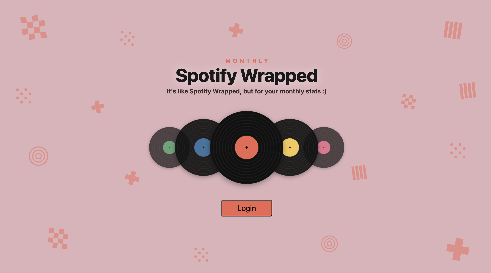
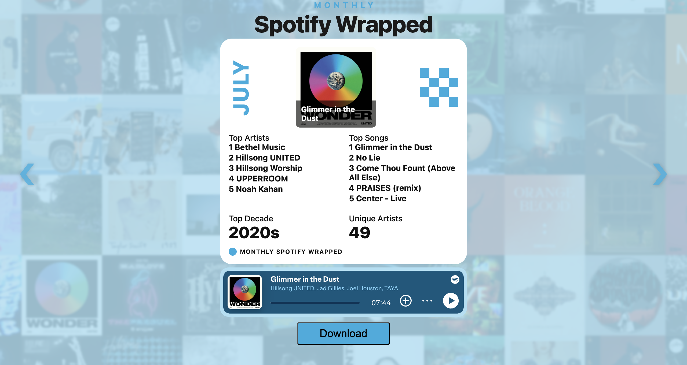
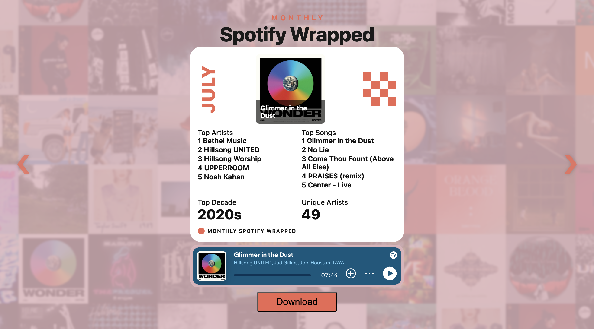
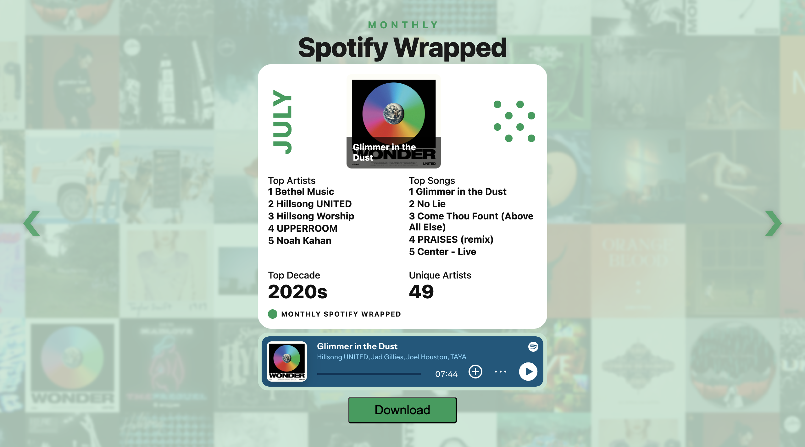
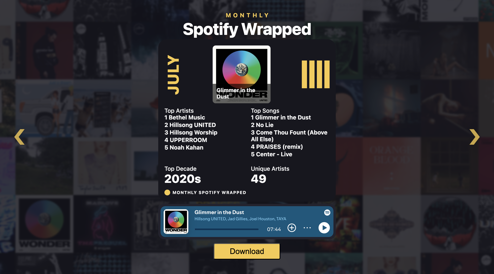
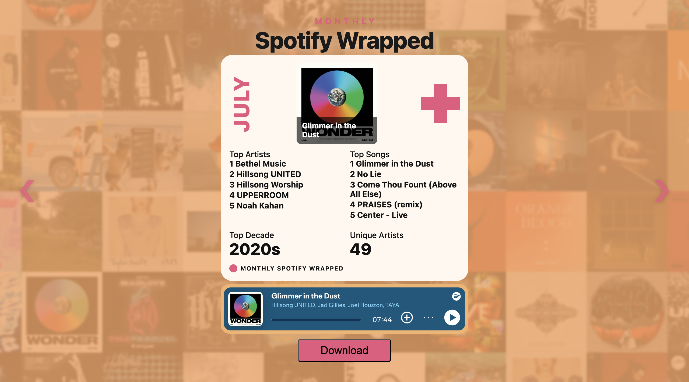
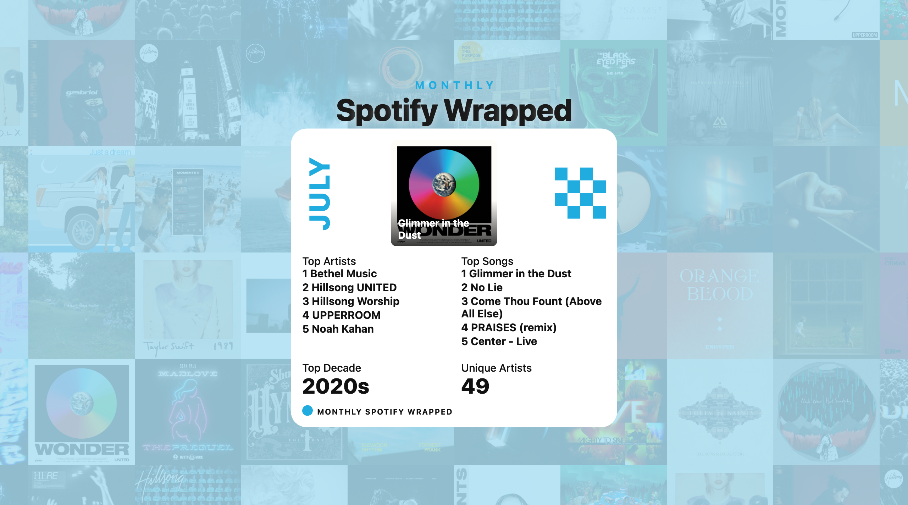
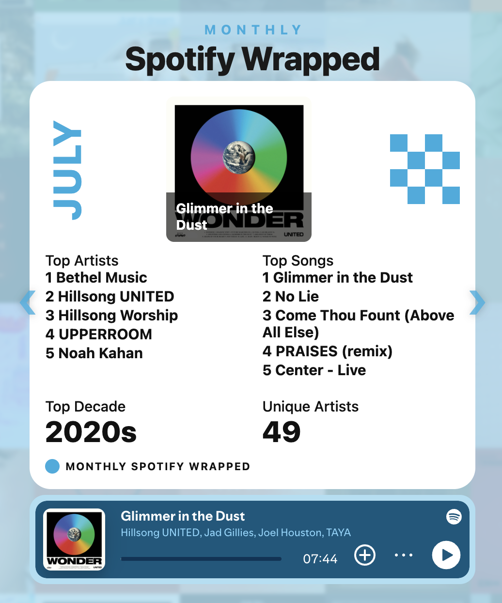

# Monthly Spotify Wrapped

Spotify Wrapped, but for your **monthly** (last ~4 weeks) listening stats — your
top artists, top songs, top decade, and more, on a shareable card you can theme
and download.

> 🔗 **Live demo:** _coming soon (deploying)_

## Demo

### Log in

A draggable, shuffling record carousel — flick the discs and each move plays a
soft click sound.



### Your monthly card

The first theme is generated automatically from your **top song's cover art**.



### Colour themes

Cycle themes with the on-screen arrows. Each recolours the page, card, month
accent, download button, and picks a different swatch shape.

| | |
|---|---|
|  |  |
|  |  |

### Download &amp; share

One click exports the card as an image, **album backdrop included**. The Download
button and the Spotify player are automatically omitted from the export:



### Mobile

On phones the Download button is hidden (just screenshot the card instead):



## Features

- **Monthly stats** — top 5 artists &amp; songs, top decade, and unique-artist
  count for your last ~4 weeks.
- **Auto theme from your top song** — the opening colour theme is derived from
  your #1 track's album art; cycle to 5 hand-picked themes with the arrows.
- **Live album-art backdrop** — a blurred wall of your top covers behind the card.
- **Inline Spotify player** — preview/play your top track without leaving the page.
- **Downloadable card** — export the whole card (with backdrop) as a JPEG; the
  button and player are excluded from the image.
- **Playful login** — a draggable record carousel with a click sound effect.
- **Responsive** — the Download button is hidden on mobile (screenshot to share).

## Setup

1. Create an app at https://developer.spotify.com/dashboard
2. Add this Redirect URI to the app: `http://127.0.0.1:5000/callback`
3. Copy `.env.example` to `.env` and fill in your Client ID and Secret.

## Install

```bash
npm install
cd server && npm install && cd ..
```

## Run (two terminals)

```bash
npm run server   # backend on 127.0.0.1:5000
npm run dev      # frontend on 127.0.0.1:3000
```

Then open http://127.0.0.1:3000 (use 127.0.0.1, not localhost).

## Notes

- The access token lasts ~1 hour. When it expires, API calls will 401 — the app
  clears the token and sends you back to the login screen.
- The token is stored in a single server variable, so it's built for one user
  at a time (fine for personal local use).
- Some Spotify data (genres, popularity, 30-second previews, batch artist
  lookups) is no longer available to apps in development mode, so this shows
  what the current API still exposes.
